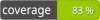

# Aegisora JSON Rule

[](https://packagist.org/packages/aegisora/json-rule)
[](https://packagist.org/packages/aegisora/json-rule)

[](LICENSE)


JSON Rule provides a simple, rule-based JSON validation implementation for the Aegisora ecosystem.

It is built on top of [`aegisora/rule-contract`](https://github.com/Aegisora/rule-contract) and follows its strict validation architecture, ensuring consistent and predictable behavior across applications.

This rule is useful for validating webhook payloads, API request bodies, configuration strings, message queue messages, and any other string that must contain well-formed JSON.

---

## 📑 Table of Contents
- [Features](#-features)
- [Installation](#-installation)
- [Core Concept](#-core-concept)
- [Basic Usage](#-basic-usage)
- [Valid vs Invalid](#-valid-vs-invalid)
- [Validation Result](#-validation-result)
- [Guardian Usage](#-guardian-usage)
- [Real-World Examples](#-real-world-examples)
- [Factory Methods](#-factory-methods)
- [Architecture](#-architecture)
- [License](#-license)
- [Contributing](#-contributing)
- [Support](#-support)

---

## ✨ Features
- 🔹 Lightweight and dependency-free except `aegisora/rule-contract`
- 🔹 Validates whether a string contains well-formed JSON
- 🔹 Backed by native `json_decode()` and `json_last_error()`
- 🔹 Accepts any valid JSON value (objects, arrays, strings, numbers, booleans, `null`)
- 🔹 Rejects non-string input as an invalid context
- 🔹 Fully compatible with Aegisora validation pipeline
- 🔹 Strict `Context` → `Result` validation flow
- 🔹 No raw booleans — only structured results
- 🔹 Safe execution via base `Rule` abstraction
- 🔹 Simple factory API (create)
- 🔹 Ready to use out of the box

---

## 📦 Installation

```bash
composer require aegisora/json-rule
```

---

## 🚀 Core Concept

This package implements a single validation rule:

- accepts a string value via `Context`
- checks whether the value is well-formed JSON
- returns a standardized `Result`

Under the hood it wraps the common boilerplate:

```php
json_decode($value);

if (json_last_error() !== JSON_ERROR_NONE) {
    // value is not valid JSON
}
```

into a reusable rule that reports its outcome through a `Result` object instead of a raw boolean.

---

## 🏗️ Basic Usage

```php
use Aegisora\RuleContract\Models\Context;
use Aegisora\Rules\JsonRule;

$result = JsonRule::create()->validate(Context::create('{"name": "Aegisora"}'));

if ($result->isValid()) {
    // value is valid JSON
} else {
    // value is not valid JSON
}
```

---

## ✅ Valid vs Invalid

The rule passes for any well-formed JSON value and fails for malformed input. Validation relies on the native JSON parser, so only strictly well-formed JSON is accepted.

### Valid JSON

```php
$rule = JsonRule::create();

$rule->validate(Context::create('{}'));                  // valid
$rule->validate(Context::create('[]'));                  // valid
$rule->validate(Context::create('[1, 2, "foo", null]'));// valid
$rule->validate(Context::create('"Hello"'));             // valid
$rule->validate(Context::create('100'));                 // valid
$rule->validate(Context::create('-5.67'));               // valid
$rule->validate(Context::create('true'));                // valid
$rule->validate(Context::create('false'));               // valid
$rule->validate(Context::create('null'));                // valid
```

### Invalid JSON

```php
$rule = JsonRule::create();

$rule->validate(Context::create(''));                    // invalid — empty string
$rule->validate(Context::create("{'key': 'value'}"));    // invalid — single quotes
$rule->validate(Context::create('{key: "value"}'));      // invalid — unquoted key
$rule->validate(Context::create('{"a": 1, "b": 2,}'));   // invalid — trailing comma
$rule->validate(Context::create('[1, 2, 3,]'));          // invalid — trailing comma
$rule->validate(Context::create('TRUE'));                // invalid — wrong case
```

---

## 🧪 Validation Result

If the value is valid JSON, the rule returns a valid result.

`$result->isValid(); // true`

If the value is not valid JSON, the rule returns an invalid result.

```php
$result->isValid(); // false
$result->getFailedRuleCode(); // json_rule
```

If the context value is not a string, the rule throws:

`Aegisora\RuleContract\Exceptions\InvalidRuleContextException`

---

## 🔗 Guardian Usage

This rule can be used together with `aegisora/guardian` to build fluent validation pipelines.

```php
use Aegisora\Guardian\Guardian;
use Aegisora\Rules\JsonRule;
use App\Exceptions\InvalidPayloadException;

$guardian = new Guardian();

$guardian
    ->that($rawPayload)
    ->must(JsonRule::create(), new InvalidPayloadException())
    ->validate();
```

If the value is not valid JSON, `Guardian` throws the provided domain exception.

---

## 🧭 Real-World Examples

JSON Rule is useful for validating string payloads before they are decoded or persisted.

Examples

```text
Webhook:

validate incoming payload body is well-formed JSON
```
```text
API Gateway:

reject requests whose body is not valid JSON
```
```text
Configuration:

ensure a JSON config string can be parsed
```
```text
Message Queue:

validate message payloads before processing
```

---

## 🧩 Factory Methods
`JsonRule::create();`
- no arguments — creates a new rule instance

`JsonRule::create()->validate($context);`
- `$context` — `Context` wrapping the string value to validate

---

## 🏛️ Architecture

This package relies on [`aegisora/rule-contract`](https://github.com/Aegisora/rule-contract).

Flow:
1. `validate()` is called
2. `Context` is passed in
3. The string value is extracted from context (non-strings raise `InvalidRuleContextException`)
4. The value is decoded with `json_decode()`
5. `json_last_error()` is checked
6. `Result` is returned — valid on success, invalid with the `json_rule` code on failure

All logic is safely handled by Rule contract.

---

## ⚖️ License

This package is open-source and licensed under the MIT License. See the [LICENSE](LICENSE) for details.

---

## 🌱 Contributing

Contributions are welcome and greatly appreciated! See the [CONTRIBUTING](CONTRIBUTING.md) for details.

---

## 🌟 Support

If you find this project useful, please consider giving it a star on GitHub!

It helps the project grow and motivates further development.
